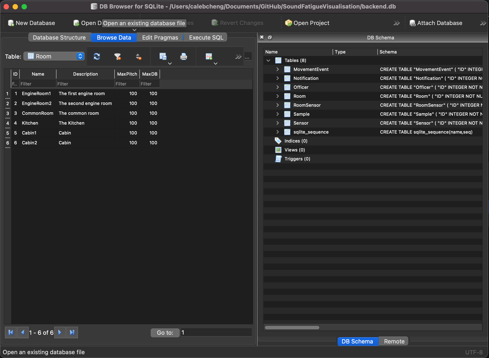

# How to install

## Requirements

* [SQLite](https://sqlitebrowser.org)
* [ReactJS](https://reactjs.org)
* [Python3](https://www.python.org)
  * We recommend creating a virtual environment in the root directory using the [`venv module`](https://docs.python.org/3/library/venv.html) default with Python.
  * `python3 -m venv 'venv'`

### Installing Python requirements

Several of the project's modules require specific Python dependencies. The fastest way to install of the at once is using the `requirements.txt` in the root directory of the project.&#x20;

1. Navigate to the root directory of the project.
2. Activate the virtual environment.&#x20;
3. `pip install -r requirements.txt`&#x20;

## Creating the database

SoundFatigueVisualisation uses SQLite as our main database backend. When the web application is first launched, or the database needs to be reinstalled, we have created a convenient SQL script to recreate the database schema and initialise it with some default values.&#x20;

Firstly, navigate to the .`/scripts/` directory in your terminal. Then, execute the following commands:

```
// This creates a new database
sqlite3 backend.db

// Within the sqlite3 prompt
.read POPULATE.sql

// Exit <Ctrl+d>
```

This should create a new database with dummy data in the `scripts `folder. We then need to move this back to the root folder

`mv backend.db ..`

The database is now ready to receive and serve sound data.

## Database Access

The easiest way to access the database is to install the [DB Browser for SQLite](https://sqlitebrowser.org).&#x20;



The database is stored in the base directory with the file name `backend.db`

