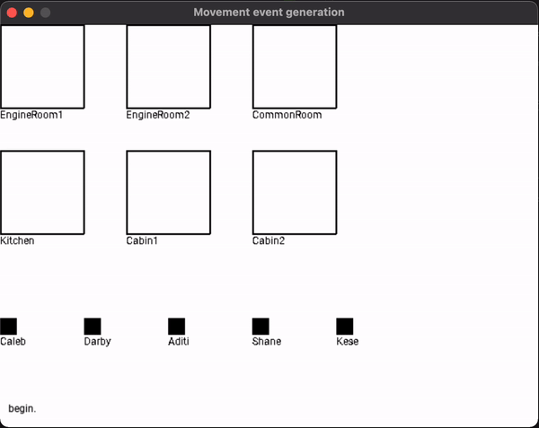

# Running the simulation

## Simulation framework`(sim_api)`

As testing our product with a full set of sensors was unviable, we have developed a framework to simulate realistic **sound levels** onboard a large vessel, as well as the **movement of users** around said vessel.&#x20;

There are two parts to the simulation framework, which are both written in Python and interact with the database:&#x20;

1. Simulating the sound in the rooms of the vessel (sim.py)&#x20;
2. Simulating the movement of officers around the vessel (movement.py)

We recommend that the framework is kept running throughout development, to ensure fresh data is constantly being outputted to the system.&#x20;

`sim.py` is a script written using `sqlalchemy` that continuously simulates any number of sensors onboard a vessel. It can handle multiple rooms, multiple sensors, and multiple sensors per room.&#x20;

To start sim.py, we must:

1. [Install the requirements](how-to-install.md#installing-python-requirements) required by Python.&#x20;
2. [Create the SQLite](how-to-install.md#creating-the-database) database and place it in the root directory.&#x20;
3. `python sim.py`

The script should start generating simulated data every 5 seconds and commit it in the `backend.db `ready for serving to the frontend.&#x20;

### movement.py

`movement.py` is an application written in PyGame used to simulate the movement of officers aboard the vessel. It reads the database for users and rooms, and allows a developer to move them around.&#x20;

To start movement.py:

1. [Install the requirements](how-to-install.md#installing-python-requirements) required by Python.&#x20;
2. [Create the SQLite](how-to-install.md#creating-the-database) database and place it in the root directory.&#x20;
3. `python movement.py`

The movement data will be written every 5 seconds and update the [`MovementEvent`](https://app.gitbook.com/o/62SoquNz2wi8xBOS53GE/s/ue9JUGeLuY2qzOD9tpjT/) table in the database.&#x20;

